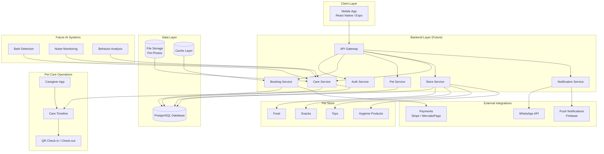

# TIOPET_SYSTEM_DIAGRAM.md

This file contains a **Mermaid architecture diagram** for the TioPet platform.
It can be opened in:

- GitHub
- VSCode Mermaid preview
- Mermaid Live Editor
- Notion
- Obsidian

---

